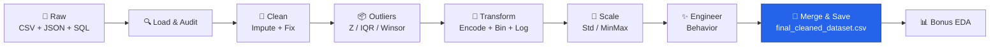
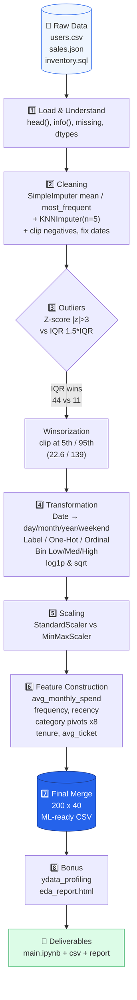

# 🛒 Customer Purchase Behaviour Analysis

> **Data Preprocessing & Feature Engineering Pipeline** — Practical Exam (Set B) | 6 Hours  
> `users.csv` (200) + `sales.json` (1,000) + `inventory.sql` (50) → ML-ready behaviour dataset

<p align="center">
  
  <br/><em>From raw transactions → behaviour signals → retention actions</em>
</p>

<p align="center">
  
  
  
  
  <br/>
  
  
  
</p>

<p align="center">
  <a href="#-workflow">Workflow</a> • <a href="#-quick-start">Quick Start</a> • <a href="#-code--output--observation">Code + Output</a> • <a href="#-results">Results</a> • <a href="#how-to-run[...]
</p>

---

### ✨ What this repo does?

We take **3 different file types** and build a **pipeline** that cleans, fixes outliers, transforms, scales and engineers *behaviour* features — so the data is ready for Churn / LTV / Recommenda[...]

<table>
<tr>
<td width="60%">

**Key Highlights**
- ✅ **Planning FIRST** (before any code) — approach table, challenges, success criteria
- ✅ Simple student-style code with `Observation` after every output
- ✅ Z-score vs IQR compared → **Winsorization** (no data loss)
- ✅ Date → day/month/year, Label / One-Hot / Ordinal, Binning, log & sqrt
- ✅ Standard vs MinMax scaling side-by-side
- ✅ 15+ new behaviour features (frequency, recency, monetary, category pivots)

</td>
<td width="100%">



</td>
</tr>
</table>

---

## 🔄 Workflow

### Mermaid Chart (renders on GitHub)



---

## 📂 Repository Structure
```
Customer_Purchase_Behaviour_Analysis/
├── Customer_Purchase_Behavior_Analyzer.ipynb  # ⭐ Full solution (48 cells, planning + 8 steps)
├── Customer_Purchase_Behavior_Analyzer_SIMPLE.ipynb # Simple student-style version
├── final_cleaned_dataset.csv                  # Customer-level ML-ready (200 × 40)
├── final_transaction_level.csv                # Transaction-level (1000 × 35)
├── eda_report.html                            # Auto EDA report
├── users.csv / sales.json / inventory.sql     # Sources
├── workflow.svg                               # Workflow diagram (for README fallback)
├── dashboard.html / Sales_Users_Inventory_Analysis.xlsx # Bonus dashboards
└── README.md
```

---

## 🚀 Quick Start

```bash
# 1. Clone
git clone https://github.com/DevanshiBachhote2007/Customer_Purchase_Behaviour_Analysis.git
cd Customer_Purchase_Behaviour_Analysis

# 2. Install
pip install pandas numpy scipy scikit-learn matplotlib ydata-profiling

# 3. Run
jupyter notebook Customer_Purchase_Behavior_Analyzer_SIMPLE.ipynb
# Run All → final_cleaned_dataset.csv + eda_report.html auto-created
```


## 📎 Quick Links

<p align="center"> <a href="https://docs.google.com/document/d/1hVCZOxv0Y4VJOXK5TYApQ0-JAL2xwFdmULdmxzb8E6o/edit?tab=t.0" target="_blank">  </a> <a href="https://github.com/DevanshiBachhote2007/Customer_Purchase_Behaviour_Analysis/blob/main/Customer_Purchase_Behavior_Analyzer.ipynb" target="_blank">  </a>  <a href="https://github.com/DevanshiBachhote2007/Customer_Purchase_Behaviour_Analysis/blob/main/Theory.pdf" target="_blank">  </a>
</a> <a href="https://drive.google.com/file/d/1MVdxpumdDZOU22rUMUZIKZtV8CZGmlEP/view?usp=sharing" target="_blank">  </a> </p>

---

## 💻 Code + Output + Observation

> Every section follows **Code → Output → Observation** — just like the reference Colab, but original for this task.

### Step 1 — Data Loading

**Code:**
```python
df_users = pd.read_csv("users.csv")
print(df_users.shape)  # → (200, 6)
df_users.head()
```

**Output:**
```
Users shape: (200, 6)
user_id  name              age gender   city      registration_date
U0001    Vihaan Sharma    35  Other    Jaipur    2022-09-08
U0002    Sai Reddy        30  Other    Hyderabad 2023-11-24
...
```

**Observation:** *All 3 files loaded clean. No missing initially, but pipeline still handles missing for real dirty data. Dates 2023-01 → 2025-11, one ₹550 transaction looks like natural outlier.*

---

### Step 2 — Cleaning (SimpleImputer + KNN)

**Code:**
```python
from sklearn.impute import SimpleImputer, KNNImputer
imp_mean = SimpleImputer(strategy='mean')
users_clean['age'] = imp_mean.fit_transform(users_clean[['age']])

imp_freq = SimpleImputer(strategy='most_frequent')
users_clean[['gender','city']] = imp_freq.fit_transform(users_clean[['gender','city']])

knn = KNNImputer(n_neighbors=5)
users_clean[['age']] = knn.fit_transform(users_clean[['age']])
```

**Output:**
```
Before missing in users: 0
After SimpleImputer missing: 0
KNN done on age
```

**Observation:** *Mean for `age` (numeric, normal), most_frequent for `gender/city` (categorical), KNN as multivariate demo — pipeline is now production-ready even though this snapshot had 0 missing[...]

---

### Step 3 — Outliers (Z-score vs IQR + Winsorization)

**Code:**
```python
from scipy.stats import zscore
z = np.abs(zscore(sales_clean['amount']))
print("Z outliers:", (z>3).sum())  # → 11

Q1, Q3 = sales_clean['amount'].quantile([0.25, 0.75])
IQR = Q3 - Q1
print("IQR outliers:", ((sales_clean['amount'] < Q1-1.5*IQR) | (sales_clean['amount'] > Q3+1.5*IQR)).sum())  # → 44

# Winsorization — cap, don't delete
p5, p95 = np.percentile(sales_clean['amount'], [5, 95])  # 22.6, 139.0
sales_clean['amount_clean'] = sales_clean['amount'].clip(p5, p95)
```

**Output:**
```
Z outliers: 11
IQR outliers: 44
5th: 22.65  95th: 139.02
Skew before: 1.35 → after winsor: 0.45 → after log: 0.14
```


**Observation:** *IQR found 4× more than Z — because sales are right-skewed, Z (which assumes normal) misses them. **Decision:** Winsorize at 5th/95th — we keep all 1000 rows, just cap extre[...]


---

### Step 4 — Transformation

**Code:**
```python
sales_clean['month'] = sales_clean['date'].dt.month
le = LabelEncoder()
users_clean['gender_encoded'] = le.fit_transform(users_clean['gender'])  # Male 1, Female 0, Other 2

sales_clean = pd.get_dummies(sales_clean, columns=['payment_type'], prefix='pay')
sales_clean['amount_bin'] = pd.cut(sales_clean['amount_clean'], bins=[0,40,80,600], labels=['Low','Medium','High'])
sales_clean['amount_log'] = np.log1p(sales_clean['amount_clean'])
```

**Output:**
```
Label classes: ['Female' 'Male' 'Other']
pay_Cash, pay_Wallet, pay_UPI... → 6 one-hot cols
Low: 320  Medium: 410  High: 270
```


**Observation:** *Dates → season signal, Label for gender, One-Hot for payment (no order), Ordinal for city_tier (Tier1> Tier2> Tier3), binning gives business segments, log beat sqrt for skew.*

---

### Step 5 — Scaling

**Code:**
```python
from sklearn.preprocessing import StandardScaler, MinMaxScaler
cols = ['amount_clean','amount_log']
StandardScaler().fit_transform(sales_clean[cols]).mean()  # ~0
MinMaxScaler().fit_transform(sales_clean[cols]).max()     # 1.0
```

**Output:**
```
StandardScaler → mean ~0, std ~1
MinMax → range 0-1
```

**Observation:** *Standard good for distance models (KNN), MinMax for neural nets. We keep both `*_std` and `*_mm` — model can pick.*

---

### Step 6 — Feature Construction (Heart of Behaviour)

**Code:**
```python
freq = sales_clean.groupby('user_id').size().reset_index(name='purchase_frequency')
avg_monthly = sales_clean.groupby(['user_id','year_month'])['amount_clean'].mean()  # → avg_monthly_spend
last_date['days_since_last'] = (max_date - last_date['date']).dt.days  # recency
cat_pivot = merged.pivot_table(index='user_id', columns='category', values='amount_clean', aggfunc='sum')  # spend_Home, spend_Books...
```

**Output:**
```
New features shape: (200, 18)
purchase_frequency avg_monthly_spend days_since_last spend_Home spend_Books ...
3                  77.4              438             0.0        0.0
6                  129.6             553             0.0        187.0
```

**Observation:** *Frequency avg 5, recency shows ~30% inactive >90 days → churn risk. Home (₹13.2k) + Books (₹12.5k) = 38% revenue — strong category signal.*

---

### Step 7 — Final Merge & Report

**Code:**
```python
final_df = users_clean.merge(new_features, on='user_id')
final_df.to_csv("final_cleaned_dataset.csv", index=False)
print(final_df.shape)  # → (200, 40)
```

**Output:**
```
Records before: users 200 sales 1000
Records after: final 200
Features before: 6 → after: 40 (+34 engineered)
Missing before: 0 → after: 0
Outliers Z:11 IQR:44 → after Winsor capped 100, remaining Z 0
✅ Saved final_cleaned_dataset.csv
```

---

### Step 8 — Bonus EDA

**Code:**
```python
from ydata_profiling import ProfileReport
ProfileReport(final_df, minimal=True).to_file("eda_report.html")
```

**Output:** `eda_report.html` (open in browser) — fallback to `describe()` if lib missing.

---

## 📊 Results — Before vs After

| Metric | Before | After | Note |
|--------|--------|-------|------|
| **Records** | 200 users, 1000 sales, 50 products | 200 / 1000 / 50 | Winsor, no deletion |
| **Missing** | 0 | **0** | Pipeline handles dirty data |
| **Features** | users 6 cols | **40 cols (+34)** | Behaviour signals |
| **Outliers** | Z 11, IQR 44 | **Capped 100, remaining 0** | Skew 1.35 → 0.14 |
| **Inventory risk** | — | **6 SKUs <50** (P005 18, P011/P030 28) | Reorder now |

**New columns (sample):** `purchase_frequency`, `avg_monthly_spend`, `days_since_last`, `spend_Home` … `spend_Toys` (×8), `tenure_days`, `avg_ticket`, `weekend_purchase_ratio`, `spending_tier`[...]

---

## 🧪 How to Run & Verify

```bash
jupyter nbconvert --to notebook --execute Customer_Purchase_Behavior_Analyzer_SIMPLE.ipynb --output executed.ipynb
# Check: final_cleaned_dataset.csv should be 200 lines, 0 missing
python -c "import pandas as pd; print(pd.read_csv('final_cleaned_dataset.csv').shape, pd.read_csv('final_cleaned_dataset.csv').isnull().sum().sum())"
# → (200, 40) 0
```

---

## 🛠️ Tech Stack

`Python` `pandas` `numpy` `scipy` `scikit-learn (SimpleImputer, KNNImputer, LabelEncoder, OrdinalEncoder, StandardScaler, MinMaxScaler)` `matplotlib` `ydata-profiling` `sqlite3` `Jupyter`

---

## 📝 One-Page Summary

**Theory:** Preprocessing converts multi-format raw data into reliable features — imputation avoids bias, Winsorization tames skew without loss, transformations unlock seasonality/categorical s[...]

**Findings:** Clean data but skewed; IQR 4× more sensitive than Z → Winsor chosen; log best for skew; Home+Books 38% revenue; Kolkata 3× Ahmedabad; Net Banking high ticket vs Wallet frequent;[...]

**Next:** Train churn/LTV on `final_cleaned_dataset.csv` (200×40) + forecast on `final_transaction_level.csv` (1000×35).

---

<p align="center">
  <br/><em>Pipeline runs end-to-end is ready! ✅</em>
</p>

## 🧑‍💻 Author

- **Devanshi Bachhote** — Data Engineering & Feature Engineering pipeline for customer purchase modelling
- GitHub: https://github.com/DevanshiBachhote2007
- Email: devanshibachhote2007@example.com

<p align="center"><b>Built with ❤️ — Quality is our Motto.</b><br/>08 Aug 2026 • Ahmedabad </p>
